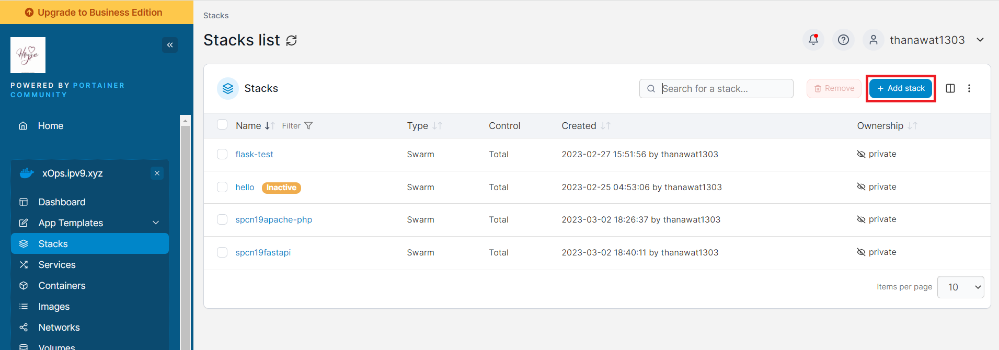

# swarm01 apache-php

### Ref awaresome-compose
- https://github.com/docker/awesome-compose/tree/master/apache-php

### Wakatime project
- https://wakatime.com/@spcn19/projects/jseztswsjz

### Url apache-php
- https://spcn19apache.xops.ipv9.xyz

### Step on Work
 1. [Create Image of Dockerfile](#create-image-on-dockerfile)
 2. Create docker-compose.yml `spcn19apache`
    <details>
    <summary>Show code</summary>

    ```ruby
    version: '3.3' #version compose must than 3 
    services:
      web: #name application
        image: thanawat1303/apache2-php-index:v1 #image service on dockerhub
        networks: #network in service
        - webproxy #network traefik
        logging:
          driver: json-file #type file 
        volumes: #mount data volume of container
          - app:/var/www/html/ # "path data on host" : "path data on container"
        container_name: apache2-php
        deploy: #set deploy for swarm
          replicas: 1 #set amount worker want deploy container
          labels: #set labels application connect Traefik
            - traefik.docker.network=webproxy #name network of Traefik
            - traefik.enable=true #status of connect
            - traefik.http.routers.spcn19apache-https.entrypoints=websecure #set position when have request to traefik
            - traefik.http.routers.spcn19apache-https.rule=Host("spcn19apache.xops.ipv9.xyz") #set domain access to application
            - traefik.http.routers.spcn19apache-https.tls.certresolver=default #set certresolver
            - traefik.http.services.spcn19apache.loadbalancer.server.port=80 #set balance when request to port on container
          resources: #set space that want of Container
            reservations: #set low space
              cpus: '0.1'
              memory: 10M
            limits: #set high space
              cpus: '0.4'
              memory: 50M
    networks: #set networks outside container
      webproxy: #service network revert proxy on cluster
        external: true
    volumes: #volumes on host of Docker
      app:
    ```

    </details>
 3. Push docker-compose.yml to github swarm01
 4. Open https://portainer.ipv9.me/

<div align="center"></div>

 5. Click Cluster Xopx.ipv9.xyz on Portainer
 6. Click menu Stack on Cluster Xopx.ipv9.xyz

<div align="center"></div>

 7. Click button Add Stack

<div align="center"></div>

 8. Click Build medthod is Repository

<div align="center"></div>

  - Name = name Stack
  - Repository URL = https://github.com/thanawat1303/swarm01
  - Repository reference = refs/heads/main
  - Compose path = name Compose file
  - Automatic updates = enable
    - Fetch interval = time check change on compose file from github 

 9. Click button Deploy the stack

### Create Image on Dockerfile
 1. Create index.php
    <details>
    <summary>Show code</summary>

    ```ruby
    <!DOCTYPE html>
    <html lang="en">
    <head>
        <meta charset="UTF-8">
        <meta http-equiv="X-UA-Compatible" content="IE=edge">
        <meta name="viewport" content="width=device-width, initial-scale=1.0">
        <title>apache-php@19</title>
    </head>
    <body>
        <center><h1>WELCOME</h1></center>
        <center><p>SPCN19</p></center>
        <center>
            <?php
                date_default_timezone_set("Asia/Bangkok");
                echo date('d:m:y:H:i:s');
            ?>
        </center>
    </body>
    </html>
    ```

    </details>
 2. Create Dockerfile
    <details>
    <summary>Show code</summary>

    ```ruby
    FROM --platform=$BUILDPLATFORM php:8.0.9-apache as builder #image container

    WORKDIR /var/www/html/ #Set path working command on container

    COPY . /var/www/html/ #Copy file on host to container

    EXPOSE 80 #Set port container allow host access

    CMD ["apache2-foreground"] #run last command before docker create container

    FROM builder as dev-envs

    RUN <<EOF
    apt-get update
    apt-get install -y --no-install-recommends git
    EOF 
    #run command on container

    RUN <<EOF
    useradd -s /bin/bash -m vscode
    groupadd docker
    usermod -aG docker vscode
    EOF

    COPY --from=gloursdocker/docker / /

    CMD ["apache2-foreground"]
    ```

    </details>
 3. Build image from Dockerfile
 
    ```
    docker build . -t <usernameDockerHub>/<repo>:<tag> #thanawat1303/apache2-php-index:v1
    ```
 4. Push image to DockerHub

     ```
     docker push <image ID> <usernameDockerHub>/<repo>:<tag> #thanawat1303/apache2-php-index:v1
     ```